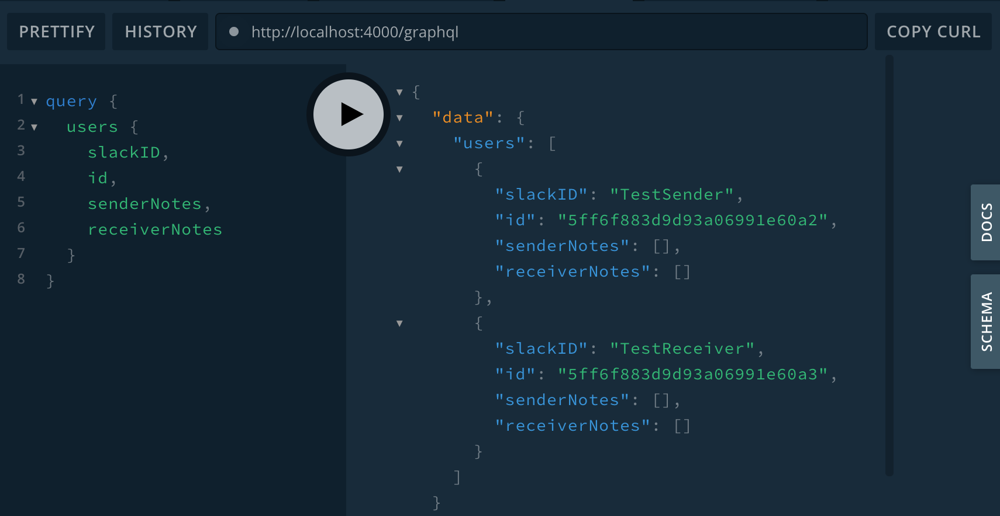

## Taped It - API

_Taped It_ allows you to send voice notes to your colleagues on [Slack](https://slack.com)

This repository hosts _Taped It_'s back end API

## Getting started

```
git clone https://github.com/voice-notes/api.git
npm install
npm start
```

Visit http://localhost:4000/graphql in your browser to interact with your local database!

## Preview



## Testing

```
npm run cy:open
```

## Technologies

| Usage               | Technology             |
| ------------------- | ---------------------- |
| Languages:          | TypeScript, JavaScript |
| Server Environment: | Node.js                |
| Server:             | Apollo Server, Express |
| Database:           | MongoDB, Mongoose      |
| Query Language:     | GraphQL                |
| Testing:            | Cypress                |

